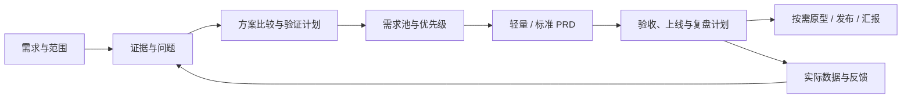

<div align="center">


# pd-skill

**把产品需求推进为有证据、有取舍、可评审、可验收的交付物。**

给你的 AI Agent 一项产品任务，按需完成需求分析、PRD、原型和上线规划。

[English](README_EN.md) · 简体中文


</div>

[安装](#安装) · [第一次使用](#第一次使用) · [使用场景](#典型任务直接复制给-agent) · [交付示例](#交付示例) · [常见问题](#常见问题)

## 安装

不熟悉命令行也可以开始。把下面这段话发给有仓库访问和本地文件操作能力的 **Agent（能读写文件、执行任务的 AI 助手）**：

```text
请帮我安装这个 Skill：https://github.com/ylm-hmt/pd-skill

先阅读仓库的 README.md 和 SKILL.md，按当前 Agent 支持的方式安装完整技能目录。
如果已经安装，请先检查版本和本地修改，保留我的定制内容。
完成后验证技能能否被读取，告诉我实际安装路径、调用方式，以及是否需要新开会话。
```

安装完成后，在 **Codex** 中用 `$pd` 调用；其他宿主采用其实际支持的调用方式，也可以直接说“使用 pd 技能”。这段话是交给 Agent 执行的安装请求，是否能自动安装取决于宿主提供的工具和权限。

### 支持的使用方式

| 环境 | 安装与使用 |
| --- | --- |
| Codex | 可安装到 `~/.codex/skills/pd`；使用 `$pd` 或自然语言指定技能 |
| Claude Code | 可按其本地技能规范放入 `~/.claude/skills/pd`；让 Agent 检查发现与调用方式 |
| 其他支持 `SKILL.md` 的 Agent | 使用宿主规定的技能目录，保留完整仓库结构 |
| 只有聊天、无法安装的环境 | 可把 `SKILL.md` 和当前任务所需参考作为上下文；文件生成、脚本及发布仍取决于可用工具 |

本仓库按 `SKILL.md` 组织，没有为每个平台提供独立插件包，也未逐一验证所有宿主版本。**“安装成功”应有实际路径和读取结果作为依据。**

<details>
<summary>手动安装到 Codex</summary>

在终端执行；需要 Git，目标目录须不存在：

```bash
git clone https://github.com/ylm-hmt/pd-skill.git ~/.codex/skills/pd
```

命令会下载仓库并创建本地目录。已有安装时先检查本地修改；不要直接覆盖。安装后按宿主要求刷新技能或新开会话。

保留 `SKILL.md`、`references/`、`subskills/`、`scripts/` 和 `agents/`。在业务项目中调用技能，交付物保存到业务项目目录。

</details>

### 环境要求

| 能力 | 需要什么 |
| --- | --- |
| 阅读方法、讨论方案、撰写内容 | 能读取技能和相关参考资料的 AI 助手 |
| 初始化本地交付目录 | Python **3.9+**，仅用标准库，无需额外安装 Python 包 |
| 获取最新竞品或平台资料 | Agent 可用的联网检索或网页读取工具 |
| 飞书发布 | 飞书 CLI、Node.js/npm、有效登录与目标权限 |
| 原型、PPT 文件、图片 | 对应的前端运行环境或生成工具，按任务启用 |

## 第一次使用

安装后，打开你的业务项目，把下面这段示例需求发给 Agent：

```text
使用 $pd，帮我设计一个面向中国中小企业的报销审批系统。

目标用户：员工、部门负责人和财务。
核心问题：报销资料不完整，财务反复退单，员工看不到审批进度。
本期范围：提交报销、审核、退回补充、状态查询。
交付要求：标准模式，完成分析、需求池和完整 PRD，保存到当前项目的 .pd/。
目前只有上述想法，没有访谈或业务数据。请区分事实、推断和假设，补上验证计划。
先完成本地交付，不需要原型、PPT 或飞书发布。
```

你可以把业务内容替换为自己的需求。信息不完整也能开始：Agent 会针对关键缺口提问，并在可继续的部分标明假设、推进交付。

**本次应拿到：** 需求分析、证据台账、需求池、验证计划、19 篇 PRD，以及产物路径和未决事项说明。脚本先建骨架，Agent 再填写内容；完成报告应说明当前达到“可评审”还是“可供研发估算”，并列出仍需确认的条件。

不必一次准备完整背景。提供下面这些信息，通常能减少返工：

| 输入 | 说明 |
| --- | --- |
| 用户与场景 | 谁在什么情况下完成什么任务 |
| 当前问题 | 具体卡点、现用办法、已有反馈或数据 |
| 期望结果 | 想改善什么，如何判断有用 |
| 约束 | 时间、预算、技术、合同或现有流程 |
| 交付范围 | 只评审、轻量 PRD、完整 PRD，是否还要原型或发布 |

已有文档时，直接给 Agent 文件路径并说明本次要补什么。后续可继续发送“只调整本期范围，并同步相关规则和验收”，不必重做整个项目。

## 适合谁使用

| 你的角色 | 可以交给 Agent 的工作 |
| --- | --- |
| 产品经理 / 产品负责人 | 需求发现、方案比较、优先级、PRD 和范围变更 |
| 创业者 / 独立开发者 | 把想法拆成可验证假设、首版范围和交付计划 |
| 设计师 / 研发 / 测试 | 澄清流程、页面状态、业务规则、依赖和验收 |
| 业务 / 运营 / 客户成功 | 整理反馈、评估定制需求、准备上线与效果复盘 |

`pd-skill` 是给 AI 助手使用的技能目录。PRD 指产品需求文档，Agent 按其中的方法读取项目资料、进行分析并生成产物。运行效果取决于输入材料、所用模型及可用工具。

## 能做什么

围绕产品从发现到交付的过程，按任务调用以下能力：

- **需求发现：**整理访谈、工单、竞品和替代方案，区分事实、推断与假设。
- **产品判断：**选用 JTBD（待完成任务）、机会解决方案树、RICE 优先级等方法，记录证据及取舍。
- **研发交付：**写需求、业务规则、权限、主异常流程、可测试验收与数据口径。
- **上线闭环：**规划灰度、回退、观察窗口和复盘，不把文档完成当作产品验证成功。
- **按需扩展：**飞书发布、可预览原型、汇报大纲和运营 brief（创作说明）。

默认用中文交付，可要求英文。脚本生成的骨架标题为中文，英文 README 不会改变模板语言；助手可在填充时按要求翻译。

## 为什么适合中国团队

方法参考了 Product on Purpose、Pawel Huryn 的开源 PM Skills、人人都是产品经理社区、腾讯 TAPD、微信小程序官方指南与 Intercom 的 RICE 说明。具体链接、核查日期、采用内容和本地改写见[来源映射](references/pm-source-map.md)，不将社区经验宣称为统一行业标准。

| 设计重点 | 如何落地 |
| --- | --- |
| 中国业务适配 | ToB 采购/使用/实施角色、标准/配置/定制边界；ToC 转化与留存；微信渠道与异常恢复；AI 评测与人工接管 |
| 按规模交付 | 轻量模式 1 篇功能规格；标准模式保留 `00–18` 共 **19 篇** PRD |
| 证据与追踪 | 证据台账、需求池、假设验证；`E-ID → REQ-ID → BR-ID → AC-ID → 指标/版本` |
| 方法口径 | RICE 统一触达、信心与投入单位；数据不足时改用定性判断并列出依据 |
| 业务适配 | 按实际用户和任务选择角色、页面及技术边界，复用已有产品资料 |
| 初始化保护 | 重复运行只补缺失文件，保留正文与飞书清单；不同标题或模式不可混入同一案例 |

## 选择交付模式

| 模式 | 适合 | PRD | 其他骨架 |
| --- | --- | --- | --- |
| `lean` | 单功能、小改版、快速评审 | `prd/01-feature-spec.md` | 需求输入、调研、分析、证据、需求池、验证计划、飞书清单 |
| `standard`（脚本默认） | 新产品、多角色系统、完整 PRD | `prd/00-…` 至 `18-…`，共 19 篇 | 轻量模式的分析材料，加聚焦判断、原型/deck/ops/图表占位 |
| 专项任务 | 仅竞品分析、排序、评审、复盘 | 按指定任务 | 不必初始化整套目录 |

标准模式的原型、汇报和运营占位文件不表示用户要求了这些交付。助手只推进用户要求的范围，已提供的 PRD 和授权直接复用。

## 典型任务：直接复制给 Agent

下面的提示词可以直接发给 Agent。除明确要求完整 PRD 外，专项任务只输出当前需要的材料。

<details open>
<summary>单功能迭代：写出可评审的轻量 PRD</summary>

```text
使用 $pd，轻量模式补齐后台批量导出需求。
重点覆盖数据权限、容量、重复操作、部分失败和验收。
先用明确标注的假设补齐未知项，保存到独立案例目录，不做原型。
```

**交付重点：** 一篇功能规格、需求与规则、主异常流程、验收条件和指标口径。

</details>

<details>
<summary>竞品与机会：决定为什么值得做</summary>

```text
使用 $pd，研究面向国内小型设计工作室的项目协作工具。
比较直接竞品，以及飞书表格、微信群和人工跟进等替代办法。
围绕同一用户任务比较流程、成本和迁移难度，记录来源与访问日期。
输出差异化机会和下一步验证建议，暂不写完整 PRD。
```

**交付重点：** 可回查的比较、适用人群、证据限制和验证方向；没有联网能力时明确说明。

</details>

<details>
<summary>需求排序：处理销售、客服与大客户反馈</summary>

```text
使用 $pd，整理当前项目里已有的客服和销售反馈，合并重复问题。
区分标准能力、可配置能力和客户定制，给出优先级与不做理由。
考虑实施、维护成本及被挤出的需求；数据不足时不要编造 RICE 分数。
```

**交付重点：** 需求池、证据关联、成本与依赖、版本建议，以及需要谁决策。

</details>

<details>
<summary>评审已有 PRD：找出阻碍开发和验收的缺口</summary>

```text
使用 $pd，评审当前项目的 .pd/prd/。
按影响排序指出范围冲突、规则缺失、异常路径、指标口径和验收问题。
每项附文档位置、可能后果和具体改法，先输出评审报告，不改原文。
```

**交付重点：** 可定位、可执行的问题清单，区分必须解决与后续优化。

</details>

<details>
<summary>AI 产品探索：先设计验证，再决定投入</summary>

```text
使用 $pd，评估给客服系统增加 AI 回复的方案，目前不能联网。
只使用已提供材料，标明假设，比较辅助草拟与自动回复的适用边界。
补充评测集设计、错误类型、转人工、延迟和有效结果成本。
交付验证计划与 PRD 草案，不虚构访谈或模型效果。
```

**交付重点：** 使用价值、风险假设、质量与成本指标、人工接管及验证条件。

</details>

<details>
<summary>后续交付：原型、汇报与飞书</summary>

```text
使用 $pd，基于当前项目已确认的 PRD 生成可预览原型。
覆盖本期核心角色、任务闭环和关键异常状态，并提供启动方式与页面覆盖清单。
```

```text
使用 $pd，将当前项目 PRD 整理成一份面向业务负责人的 10 页汇报大纲。
每页写清结论、依据、讲稿提示和需要拍板的事项。
```

```text
使用 $pd，为当前项目的 PRD 准备飞书发布计划。
检查可分享范围和本地清单，列出需要提供的目标信息；本次先不实际发布。
```

**交付重点：** 原型必须有可预览代码；汇报大纲与真实 PPT 文件分开；实际发布时提供明确目标并授权。

</details>

## 交付示例

以“后台批量导出”为例，下面展示需求、规则和验收如何对应。**这是演示片段，内容为示例，不能当作真实调研或测试结果。**

| 层级 | 示例内容 |
| --- | --- |
| 问题与假设 `E-001` | 假设运营需要导出当前筛选结果做月度核对；尚待访谈和数据验证 |
| 功能需求 `REQ-001` | 有导出权限的用户可导出本次筛选结果；数据范围须遵循现有访问权限 |
| 业务规则 `BR-001` | 服务端核对导出权限及数据范围；处理同一请求的重复提交时不重复创建任务 |
| 验收 `AC-001` | 前提：用户无导出权限；动作：请求导出；结果：拒绝请求，不生成文件，并给出明确提示 |
| 验收 `AC-002` | 前提：用户有权限且数据有效；动作：重复提交同一请求；结果：返回同一任务记录 |
| 指标 `MET-001` | 导出成功率 = 观察窗口内成功任务数 / 终态任务数；按任务 ID 去重，明确失败与取消的统计口径 |
| 上线与复盘 | 先对指定用户组开放，观察失败原因和处理耗时；再依据约定护栏决定扩大或回退 |

这样的对应关系能帮助产品确认价值、研发澄清实现、测试编写用例，并让运营知道上线后观察什么。完整质量要求见 [PRD 交付与复审标准](references/prd-quality-gates.md)。

## 工作流与完成标准



合格交付应有证据或明确缺口、清晰范围、可追踪需求、可观察验收、指标口径、上线回退条件和未决事项。没有真实数据时交验证/复盘计划；没有实际审批时不称“已批准”；骨架里还有关键占位时不称“可直接开发”。

## 输出目录

```text
.pd/
├── brief/                   # 原始需求、调研与竞品
├── analysis/
│   ├── 01-brainstorm.md
│   ├── 02-jobs-product-lens.md   # 仅标准模式，聚焦判断
│   ├── 03-evidence-ledger.md
│   ├── 04-demand-backlog.md
│   └── 05-validation-plan.md
├── prd/                     # 轻量 1 篇 / 标准 19 篇
├── prototype/               # 标准模式占位，按需实现
├── deck/                    # 标准模式占位，按需生成
├── ops/                     # 标准模式占位，按需生成
├── diagrams/                # 标准模式图表产物目录
└── feishu/                  # manifest、发布计划和结果
```

完整文件列表见[产物结构](references/artifact-structure.md)。核心需求用 `REQ-ID` 串联证据、规则与验收；飞书清单默认只包含 PRD。

## 飞书发布与可选工具

本地交付不需要飞书。发布需要用户明确要求、可唯一定位的目标，以及有效的账号权限。已有授权不重复确认；“准备发布”只生成计划。

飞书 CLI（命令行工具）用于检查权限和发布文档，可按其官方说明配置应用与登录，安装命令为 `npm install -g @larksuite/cli`，需要 Node.js/npm。未安装时检查脚本会尝试通过 `npx` 下载并运行 CLI：

```bash
python3 scripts/feishu_preflight.py --wiki
python3 scripts/feishu_wiki_targets.py
```

这两条用于授权检查和读取目标，不负责自动发布整套文档。代理按[发布指南](references/feishu-publishing.md)执行写入并记录逐篇链接。默认推荐 `知识库 → 产品部门 → 产品名`，实际目标以用户指定为准。

发布会写入外部工作区，仅发布清单中的可分享 PRD；原始访谈和内部证据不默认发布。Mermaid 源文本保留在本地；飞书画板需要相应能力，并须实际检查渲染和可编辑性。

原型依赖所选前端环境；实际 PPT 和图片需相应生成工具。brief、逐页大纲与代码不等同于已生成的图片或 `.pptx` 文件。

## 常见问题

<details>
<summary>安装完后，Agent 找不到 pd 怎么办？</summary>

先让 Agent 报告技能的实际路径，并读取其中的 `SKILL.md`。检查宿主是否使用该目录、是否需要刷新或新开会话，以及 `references/` 等文件是否齐全。Codex 可尝试显式调用 `$pd`。如果宿主不支持自动发现，可以在会话中指定 `SKILL.md` 的路径，让它按需读取参考。

</details>

<details>
<summary>我不会写代码，也需要自己运行 Python 吗？</summary>

不需要。让有文件和终端能力的 Agent 处理初始化与内容填写即可。Python 脚本只负责建目录和模板；用户主要提供问题、资料、约束和需要的交付物。

</details>

<details>
<summary>每次都会生成 19 篇 PRD 吗？</summary>

不会。小功能用 `lean`，完整产品用 `standard`。只做调研、优先级、评审或复盘时，可直接完成专项任务。明确说“只做轻量 PRD”或“仅评审已有文档”即可控制范围。

</details>

<details>
<summary>没有联网、飞书或原型工具，能用吗？</summary>

可以根据已有材料完成本地分析和 PRD。无法获取最新资料时标注未核实；飞书和原型能力只在相关任务中需要。缺少工具时交付可完成的内容和具体阻塞，不冒充已搜索、已生成或已发布。

</details>

<details>
<summary>资料会自动上传到飞书吗？</summary>

只有你明确要求发布且目标清楚、权限可用时才执行。默认发布清单只含 PRD，内部访谈和证据留在案例目录。模型请求、上下文传输和联网行为由所用 Agent 及服务配置决定，本技能不提供独立的离线推理环境。

</details>

<details>
<summary>怎么更新？重复运行会覆盖我的成果吗？</summary>

可以给 Agent 发“检查 pd-skill 的上游更新，保留本地定制，说明差异后按当前授权更新”。技能更新与案例初始化是两件事：初始化只补缺失文件，保留正文及发布清单；更新技能仓库时应先检查本地修改。不同项目或模式使用独立案例目录，移动案例后检查清单中的绝对路径。

</details>

<details>
<summary>怎样给项目反馈？</summary>

在 [GitHub Issues](https://github.com/ylm-hmt/pd-skill/issues) 中提供：任务目标、宿主及模型、输入的脱敏片段、期望结果、实际问题和相关文档位置。真实案例比笼统评价更便于改进；请移除客户身份、内部链接和凭证。

</details>

## 进阶：手动初始化

<details>
<summary>手动初始化、命令行参数与重复运行行为</summary>

在仓库根目录试用脚本：

```bash
python3 scripts/init_pm_case.py --title "企业报销系统"
python3 scripts/init_pm_case.py --title "批量导出改版" --profile lean --nested
```

第一条创建当前目录的 `.pd/`；第二条创建 `.pd/批量导出改版/`。在业务项目中使用时，指定脚本安装位置：

```bash
python3 ~/.codex/skills/pd/scripts/init_pm_case.py \
  --title "订单退款流程" --profile lean --base-dir .pd --nested
```

| 参数 | 说明 |
| --- | --- |
| `--title` | 必填，非空单行标题 |
| `--profile` | `standard` 或 `lean`，默认 `standard` |
| `--base-dir` | 输出目录，默认当前工作目录的 `.pd/` |
| `--nested` | 在输出目录下追加项目 slug |
| `--slug` | 自定义目录名，允许英文、数字、中文、`-`、`_` |

脚本不联网、不发布，只创建缺失文件。重复运行保留既有内容与清单，旧清单按标准模式兼容。切换模式或新建项目请用独立目录；移动案例后需检查清单中的绝对路径。

</details>

## 参考与验证

初始化行为有[自动化测试](tests/test_init_pm_case.py)覆盖；文档判断可按[质量标准中的场景](references/prd-quality-gates.md)检查。脚本验证与业务验证分别进行。

普通安装不需要刷新子技能副本；相关来源和更新注意事项见[第三方来源](references/vendor-sources.md)。

| 文件 | 用途 |
| --- | --- |
| [SKILL.md](SKILL.md) | 技能入口和任务路由 |
| [中国场景指南](references/china-pm-playbook.md) | 国内业务与协作 |
| [发现与证据](references/discovery-and-evidence.md) | 访谈、竞品、假设验证 |
| [方法选择](references/product-thinking-frameworks.md) | 优先级、商业判断、指标 |
| [质量标准](references/prd-quality-gates.md) | PRD 复审、验收、上线复盘 |
| [来源映射](references/pm-source-map.md) | 查阅来源、采用理由与边界 |
| [第三方来源](references/vendor-sources.md) | 既有子技能出处 |
