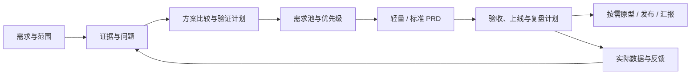

<div align="center">


# pd-skill

**面向中国团队的产品经理 Skill：从需求证据、方案取舍到 PRD、验收和上线复盘。**

[English](README_EN.md) · 简体中文


</div>

## 能做什么

`pd-skill` 是由 AI 助手读取的工作流与模板集合，调用名称是 **`$pd`**。它帮助产品、设计、研发、测试和运营对齐问题、范围与验收标准。

- 需求发现：整理访谈、工单、竞品和替代方案，区分事实、推断与假设。
- 产品判断：选用 JTBD（待完成任务）、机会解决方案树、RICE 优先级等方法，记录证据及取舍。
- 研发交付：写需求、业务规则、权限、主异常流程、可测试验收与数据口径。
- 上线闭环：规划灰度、回退、观察窗口和复盘，不把文档完成当作产品验证成功。
- 按需扩展：飞书发布、可预览原型、汇报大纲和运营 brief（创作说明）。

默认用中文交付，可要求英文。脚本生成的骨架标题为中文，英文 README 不会改变模板语言；助手可在填充时按要求翻译。

## 本次升级

参考了 Product on Purpose、Pawel Huryn 的开源 PM Skills、人人都是产品经理社区、腾讯 TAPD、微信小程序官方指南与 Intercom 的 RICE 说明。具体链接、核查日期、采用内容和本地改写见[来源映射](references/pm-source-map.md)，不将社区经验宣称为统一行业标准。

| 改进 | 实际变化 |
| --- | --- |
| 中国业务适配 | ToB 采购/使用/实施角色、标准/配置/定制边界；ToC 转化与留存；微信渠道与异常恢复；AI 评测与人工接管 |
| 按规模交付 | 轻量模式 1 篇功能规格；标准模式保留 `00–18` 共 **19 篇** PRD |
| 证据与追踪 | 证据台账、需求池、假设验证；`E-ID → REQ-ID → BR-ID → AC-ID → 指标/版本` |
| 方法纠偏 | 统一 RICE 单位、信心和投入口径；去除无依据的通用市场份额、调研数量等硬阈值 |
| 通用模板 | 不再固定为高校任务平台；角色、页面和技术边界由实际需求决定 |
| 初始化保护 | 重复运行只补缺失文件，保留正文与飞书清单；不同标题或模式不可混入同一案例 |

## 安装与调用

需要支持本地 Skills 的 AI 助手。使用初始化脚本需要 **Python 3.9+**，仅用标准库，无需 `pip install`。Git 用于克隆仓库。

例如，安装到 Codex 的本地技能目录：

```bash
git clone https://github.com/ylm-hmt/pd-skill.git ~/.codex/skills/pd
```

命令会下载仓库并创建本地目录，已有目录时不要覆盖。也可把整个目录放入所用助手的技能目录；保留 `references/`、`subskills/` 和 `scripts/`，具体发现方式取决于宿主。安装后在助手中调用：

```text
使用 $pd，为一个面向中国中小企业的报销系统输出完整 PRD。
目标是减少财务退单；已有审批制度和 20 条匿名工单。
先做本地交付，未知数据标为假设。
```

本仓库没有注册 `/write-prd` 等其他项目的快捷命令。初始化脚本只创建模板，内容分析由助手执行。

## 选择交付模式

| 模式 | 适合 | PRD | 其他骨架 |
| --- | --- | --- | --- |
| `lean` | 单功能、小改版、快速评审 | `prd/01-feature-spec.md` | 需求输入、调研、分析、证据、需求池、验证计划、飞书清单 |
| `standard`（脚本默认） | 新产品、多角色系统、完整 PRD | `prd/00-…` 至 `18-…`，共 19 篇 | 轻量模式的分析材料，加聚焦判断、原型/deck/ops/图表占位 |
| 专项任务 | 仅竞品分析、排序、评审、复盘 | 按指定任务 | 不必初始化整套目录 |

标准模式的原型、汇报和运营占位文件不表示用户要求了这些交付。助手只推进用户要求的范围，已提供的 PRD 和授权直接复用。

## 快速开始

在仓库根目录试用脚本：

```bash
python3 scripts/init_pm_case.py --title "企业报销系统"
python3 scripts/init_pm_case.py --title "批量导出改版" --profile lean --nested
```

第一条创建当前目录的 `.pd/`；第二条创建 `.pd/批量导出改版/`。在业务项目中使用时，指定脚本安装位置：

```bash
python3 ~/.codex/skills/pd/scripts/init_pm_case.py \
  --title "订单退款流程" --profile lean --base-dir .pd --nested
```

| 参数 | 说明 |
| --- | --- |
| `--title` | 必填，非空单行标题 |
| `--profile` | `standard` 或 `lean`，默认 `standard` |
| `--base-dir` | 输出目录，默认当前工作目录的 `.pd/` |
| `--nested` | 在输出目录下追加项目 slug |
| `--slug` | 自定义目录名，允许英文、数字、中文、`-`、`_` |

脚本不联网、不发布，只创建缺失文件。重复运行保留既有内容与清单，旧清单按标准模式兼容。切换模式或新建项目请用独立目录；移动案例后需检查清单中的绝对路径。

## 典型输入

**小功能需求：**

```text
使用 $pd，轻量模式补齐后台批量导出需求。
重点覆盖数据权限、容量、重复操作、部分失败和验收；不做原型。
```

**需求排序：**

```text
使用 $pd，整理这些客服和销售反馈，合并重复问题并给出优先级理由。
区分标准能力、配置和客户定制，成本未知时不要编造 RICE 分数。
```

**没有调研数据：**

```text
使用 $pd，评估给客服系统增加 AI 回复的方案。暂时不能联网。
使用现有材料，标明假设，交付验证计划和 PRD 草案，不虚构访谈。
```

**追加原型或发布：**

```text
基于已确认 PRD 生成可预览的原型，并提供启动方式。
```

```text
把本地 PRD 发布到我提供的飞书知识库节点：[节点链接]。
产品名：企业报销。只发布 PRD，保留内部证据在本地。
```

## 工作流与完成标准



合格交付应有证据或明确缺口、清晰范围、可追踪需求、可观察验收、指标口径、上线回退条件和未决事项。没有真实数据时交验证/复盘计划；没有实际审批时不称“已批准”；骨架里还有关键占位时不称“可直接开发”。

## 输出目录

```text
.pd/
├── brief/                   # 原始需求、调研与竞品
├── analysis/
│   ├── 01-brainstorm.md
│   ├── 02-jobs-product-lens.md   # 仅标准模式，聚焦判断
│   ├── 03-evidence-ledger.md
│   ├── 04-demand-backlog.md
│   └── 05-validation-plan.md
├── prd/                     # 轻量 1 篇 / 标准 19 篇
├── prototype/               # 标准模式占位，按需实现
├── deck/                    # 标准模式占位，按需生成
├── ops/                     # 标准模式占位，按需生成
├── diagrams/                # 标准模式图表产物目录
└── feishu/                  # manifest、发布计划和结果
```

完整文件列表见[产物结构](references/artifact-structure.md)。核心需求用 `REQ-ID` 串联证据、规则与验收；飞书清单默认只包含 PRD。

## 飞书发布与可选工具

本地交付不需要飞书。发布需要用户明确要求、可唯一定位的目标，以及有效的账号权限。已有授权不重复确认；“准备发布”只生成计划。

飞书 CLI（命令行工具）用于检查权限和发布文档，可按其官方说明配置应用与登录，安装命令为 `npm install -g @larksuite/cli`，需要 Node.js/npm。未安装时检查脚本会尝试通过 `npx` 下载并运行 CLI：

```bash
python3 scripts/feishu_preflight.py --wiki
python3 scripts/feishu_wiki_targets.py
```

这两条用于授权检查和读取目标，不负责自动发布整套文档。代理按[发布指南](references/feishu-publishing.md)执行写入并记录逐篇链接。默认推荐 `知识库 → 产品部门 → 产品名`，实际目标以用户指定为准。

发布会写入外部工作区，仅发布清单中的可分享 PRD；原始访谈和内部证据不默认发布。Mermaid 源文本保留在本地；飞书画板需要相应能力，并须实际检查渲染和可编辑性。

原型依赖所选前端环境；实际 PPT 和图片需相应生成工具。brief、逐页大纲与代码不等同于已生成的图片或 `.pptx` 文件。

## 维护与验证

```bash
python3 -m unittest discover -s tests -v
```

测试覆盖模式、清单、重复初始化、旧清单兼容及非法路径等行为。文档决策质量还需按[质量标准中的场景](references/prd-quality-gates.md)检查，脚本通过不代表商业判断正确。

`scripts/bootstrap_subskills.sh` 是维护者刷新上游副本的工具，会联网并替换 `subskills/`，可能覆盖本地定制。普通使用不需要运行；更新前保存改动并审查差异。

| 文件 | 用途 |
| --- | --- |
| [SKILL.md](SKILL.md) | 技能入口和任务路由 |
| [中国场景指南](references/china-pm-playbook.md) | 国内业务与协作 |
| [发现与证据](references/discovery-and-evidence.md) | 访谈、竞品、假设验证 |
| [方法选择](references/product-thinking-frameworks.md) | 优先级、商业判断、指标 |
| [质量标准](references/prd-quality-gates.md) | PRD 复审、验收、上线复盘 |
| [来源映射](references/pm-source-map.md) | 查阅来源、采用理由与边界 |
| [第三方来源](references/vendor-sources.md) | 既有子技能出处 |
