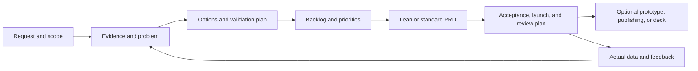

<div align="center">


# pd-skill

**A product management skill for teams building for the Chinese market: from evidence and prioritization to PRDs, acceptance criteria, and launch reviews.**

English · [简体中文](README.md)


</div>

## What it does

`pd-skill` is a collection of instructions, references, and templates read by an AI assistant. Its invocation name is **`$pd`**. It helps product, design, engineering, QA, and operations teams agree on the problem, scope, and acceptance criteria.

- **Discovery:** synthesize interviews, support tickets, competitors, and alternatives; separate facts, inferences, and assumptions.
- **Decisions:** choose suitable methods such as Jobs to Be Done, opportunity solution trees, or RICE, and record evidence and tradeoffs.
- **Delivery:** specify requirements, business rules, permissions, normal and failure flows, acceptance criteria, and metric definitions.
- **Learning:** plan staged rollout, rollback, observation, and post-launch review without treating document completion as product validation.
- **Optional outputs:** Feishu documents, previewable prototypes, presentation outlines, and campaign briefs.

Deliverables default to Simplified Chinese. Request English when needed. The initializer creates Chinese-language templates; this English README does not change their language. The assistant can translate them while completing the content.

## What changed

This revision draws on Product on Purpose and Pawel Huryn's PM Skills, the Chinese PM community *人人都是产品经理*, Tencent TAPD, WeChat's official Mini Program design guidelines, and Intercom's RICE explanation. The [source map](references/pm-source-map.md) records exact links, the review date, adaptations, and limitations. Community advice is not presented as a universal industry standard.

| Improvement | Behavior |
| --- | --- |
| Chinese-market context | B2B buying, usage, and implementation roles; standard/configurable/custom scope; B2C conversion and retention; WeChat recovery flows; AI evaluation and human handoff |
| Proportional scope | One feature specification in lean mode, or **19 PRD documents**, numbered `00–18`, in standard mode |
| Evidence and traceability | Evidence ledger, demand backlog, validation plan, and `E-ID → REQ-ID → BR-ID → AC-ID → metric/release` |
| Better method guidance | Consistent RICE units, confidence, and effort; no arbitrary universal market-share or research quotas |
| General templates | No fixed university task-platform roles, screens, or technical architecture |
| Safer initialization | Reruns add missing files while preserving edited documents and manifests; conflicting projects or profiles are rejected |

## Install and invoke

Use an AI assistant that supports local skills. The initializer requires **Python 3.9+** and uses only the standard library; no pip packages are needed. Git is required for cloning.

For example, install into Codex's local skill directory:

```bash
git clone https://github.com/ylm-hmt/pd-skill.git ~/.codex/skills/pd
```

This downloads the repository and creates a local directory. Do not overwrite an existing installation. Other hosts can use the complete directory in their supported skill location; keep `references/`, `subskills/`, and `scripts/` together. Discovery behavior depends on the host.

Invoke it in your assistant:

```text
Use $pd to create a complete PRD for an expense reimbursement system
for small businesses in China. The goal is to reduce rejected submissions.
Use our existing approval policy and 20 anonymized support tickets.
Deliver locally and label unknowns as assumptions. Write the output in English.
```

This repository does not register commands such as `/write-prd` from other projects. The Python script creates templates; the assistant performs the product analysis.

## Choose a delivery mode

| Mode | Suitable for | PRD output | Other scaffolding |
| --- | --- | --- | --- |
| `lean` | A feature, small revision, or quick review | `prd/01-feature-spec.md` | Request, research, analysis, evidence, backlog, validation plan, and Feishu manifest |
| `standard` (script default) | New products, multiple roles, complete specifications | 19 documents, numbered `00–18` | Shared analysis plus a focus review and prototype/deck/ops/diagram placeholders |
| Focused task | Competitor analysis, prioritization, PRD review, or retrospective | Only the requested artifact | No need to initialize the full workspace |

Standard-mode placeholders do not imply that prototypes, decks, or campaigns were requested. The assistant completes the agreed scope and reuses existing PRDs, decisions, and authorization.

## Quick start

From the repository root:

```bash
python3 scripts/init_pm_case.py --title "Expense Reimbursement"
python3 scripts/init_pm_case.py --title "Batch Export" --profile lean --nested
```

The first command creates `.pd/` in the current working directory. The second creates `.pd/batch-export/`. To use the installed skill from a business project:

```bash
python3 ~/.codex/skills/pd/scripts/init_pm_case.py \
  --title "Refund Flow" --profile lean --base-dir .pd --nested
```

| Argument | Meaning |
| --- | --- |
| `--title` | Required, nonempty, single-line project title |
| `--profile` | `standard` or `lean`; defaults to `standard` |
| `--base-dir` | Output directory; defaults to `.pd/` under the current working directory |
| `--nested` | Append the project slug to the output directory |
| `--slug` | Custom directory name using ASCII letters, digits, Chinese characters, `-`, or `_` |

The initializer creates missing files locally, without network access or publishing. Reruns preserve existing content and manifests. Legacy manifests are treated as standard mode. Use a separate directory for a different project or profile. Check absolute paths in the manifest after moving a case directory.

## Example requests

**Small feature:**

```text
Use $pd in lean mode to specify batch export in our admin console.
Cover data permissions, capacity, duplicate operations, partial failures,
and acceptance criteria. Do not generate a prototype.
```

**Prioritization:**

```text
Use $pd to group these support and sales requests and explain their priority.
Distinguish standard capabilities, configuration, and customer-specific work.
Do not invent RICE scores when effort or evidence is missing.
```

**No research data:**

```text
Use $pd to assess AI-generated replies for our support product.
Web access is unavailable. Use the supplied material, label assumptions,
and produce a validation plan and PRD draft without inventing interviews.
```

**Prototype or publishing:**

```text
Build a previewable prototype from the agreed PRD and provide startup instructions.
```

```text
Publish the local PRD to this Feishu knowledge-base node: [node URL].
Product name: Expense Reimbursement. Publish only the PRD;
keep internal evidence local.
```

## Workflow and completion



A useful deliverable has evidence or explicit gaps, clear scope, traceable requirements, observable acceptance criteria, metric definitions, rollout/rollback conditions, and open decisions. Without actual data, deliver a validation or review plan. Without recorded approval, do not claim approval. A skeleton with unresolved core placeholders is not development-ready.

## Output structure

```text
.pd/
├── brief/                   # Original request and research
├── analysis/
│   ├── 01-brainstorm.md
│   ├── 02-jobs-product-lens.md   # Standard mode only: focus review
│   ├── 03-evidence-ledger.md
│   ├── 04-demand-backlog.md
│   └── 05-validation-plan.md
├── prd/                     # One lean spec or 19 standard documents
├── prototype/               # Standard placeholders; implement on request
├── deck/                    # Standard placeholders; generate on request
├── ops/                     # Standard placeholders; generate on request
├── diagrams/                # Standard diagram artifact directory
└── feishu/                  # Manifest, publishing plan, and results
```

See the [artifact structure](references/artifact-structure.md) for the full file list. Stable IDs connect evidence, requirements, rules, and acceptance criteria. Only PRD documents are included in the default publishing manifest.

## Feishu and optional tools

Local work does not require Feishu. Publishing requires an explicit request, an unambiguous destination, and valid account permissions. Existing authorization remains valid; a request to *prepare* publishing produces a plan only.

The Feishu CLI checks permissions and publishes documents. Install it with `npm install -g @larksuite/cli` using Node.js/npm, and follow its official setup instructions for app configuration and login. If it is not installed, the helper scripts attempt to download and run it through `npx`:

```bash
python3 scripts/feishu_preflight.py --wiki
python3 scripts/feishu_wiki_targets.py
```

These commands check authorization and read destinations; they do not publish the entire PRD automatically. The assistant follows the [publishing guide](references/feishu-publishing.md) and records individual document links. A suggested structure is `Knowledge Base → Product Department → Product Name`; the user's destination takes precedence.

Publishing writes to an external workspace. Share only approved PRD content from the manifest; raw interviews and internal evidence remain local by default. Keep Mermaid source locally, and verify actual rendering and editability when using Feishu whiteboards.

Prototypes depend on the selected frontend environment. Actual `.pptx` and image files require suitable generation tools. A brief, outline, or code artifact is not an exported presentation or image.

## Maintenance and validation

```bash
python3 -m unittest discover -s tests -v
```

Tests cover profiles, manifests, reruns, legacy compatibility, and invalid paths. Use the [behavioral scenarios](references/prd-quality-gates.md) to assess product judgment separately; passing script tests does not validate a business decision.

`scripts/bootstrap_subskills.sh` refreshes upstream copies. It downloads dependencies and replaces `subskills/`, potentially overwriting local adaptations. Normal use does not require it. Preserve local changes and review diffs before refreshing.

| Resource | Purpose |
| --- | --- |
| [SKILL.md](SKILL.md) | Entrypoint and task routing |
| [Chinese-market playbook](references/china-pm-playbook.md) | Business contexts and collaboration |
| [Discovery and evidence](references/discovery-and-evidence.md) | Interviews, competitors, and validation |
| [Product frameworks](references/product-thinking-frameworks.md) | Prioritization, commercial decisions, and metrics |
| [Quality gates](references/prd-quality-gates.md) | Review, acceptance, rollout, and retrospectives |
| [Source map](references/pm-source-map.md) | Reviewed sources and adaptation boundaries |
| [Vendored sources](references/vendor-sources.md) | Attribution for existing bundled skills |
