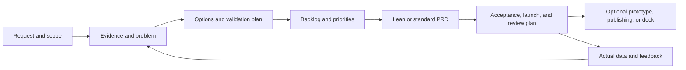

<div align="center">


# pd-skill

**Turn product ideas into evidence-backed requirements, decisions, and reviewable deliverables.**

Give your AI agent a product task, from discovery and PRDs to prototypes and launch planning, with guidance for the Chinese market.

English · [简体中文](README.md)


</div>

[Install](#install) · [Quickstart](#quickstart) · [Example requests](#example-requests) · [Example deliverable](#example-deliverable) · [FAQ](#faq)

## Install

Ask an **agent with repository access and local file tools** to install the skill. Copy this message:

```text
Please install this skill: https://github.com/ylm-hmt/pd-skill

Read the repository's README.md and SKILL.md, then install the complete
skill directory using the conventions supported by this agent.
If it is already installed, check the version and local changes first;
preserve my customizations.
Verify that the skill can be read, and report its actual location,
how to invoke it, and whether I need to start a new session.
```

In **Codex**, invoke it with `$pd`. For other hosts, use the supported invocation or ask to “use the pd skill.” This is an installation request for the agent to execute; automatic installation depends on the host's tools and permissions.

### Ways to use it

| Environment | Installation and invocation |
| --- | --- |
| Codex | Install into `~/.codex/skills/pd`; invoke with `$pd` or name the skill in your request |
| Claude Code | Follow its local-skill conventions, such as `~/.claude/skills/pd`; ask the agent to verify discovery and invocation |
| Other agents that support `SKILL.md` | Use the host's skill directory and preserve the full repository structure |
| Chat-only environments | Supply `SKILL.md` and the references needed for the task as context; files, scripts, and publishing still depend on available tools |

This repository uses the `SKILL.md` format. It does not ship a separate plugin for every platform, and every host version has not been tested. **A successful installation should be backed by an actual path and a successful read.**

<details>
<summary>Manual installation for Codex</summary>

Run this in a terminal with Git installed and no existing destination directory:

```bash
git clone https://github.com/ylm-hmt/pd-skill.git ~/.codex/skills/pd
```

The command downloads the repository and creates a local directory. Check local modifications before updating an existing installation. Refresh skills or start a new session as required by the host.

Keep `SKILL.md`, `references/`, `subskills/`, `scripts/`, and `agents/` together. Invoke the skill from your business project so deliverables are saved there.

</details>

### Requirements

| Capability | Requirement |
| --- | --- |
| Use the methods and draft content | An assistant that can read the skill and relevant references |
| Initialize local artifacts | Python **3.9+**, standard library only; no extra Python packages |
| Research current competitors or platform rules | Web search or page-reading tools available to the agent |
| Publish to Feishu | Feishu CLI, Node.js/npm, valid login, and destination permissions |
| Generate prototypes, presentation files, or images | Suitable frontend or generation tools, enabled as needed |

## Quickstart

After installation, open your business project and send this complete example:

```text
Use $pd to design an expense approval system for small businesses in China.

Users: employees, department managers, and finance staff.
Problem: incomplete claims cause repeated rejections, and employees
cannot see approval progress.
Scope: submit claims, review them, request corrections, and view status.
Deliverables: standard mode, including analysis, a backlog, and the complete
PRD set. Save artifacts to .pd/ in the current project. Write in English.
We only have this idea, with no interviews or business data yet.
Separate facts, inferences, and assumptions, and include a validation plan.
Deliver locally; no prototype, deck, or Feishu publishing is needed.
```

Replace the business details with your own request. You can start with incomplete information: the agent asks about gaps that materially affect the work and continues with labeled assumptions where possible.

**Expected output:** problem analysis, an evidence ledger, a demand backlog, a validation plan, 19 PRD documents, and a completion report with paths and open decisions. The script scaffolds files; the agent completes their content. The report should distinguish review-ready material from material ready for engineering estimation and identify outstanding conditions.

These inputs usually reduce rework:

| Input | Include |
| --- | --- |
| Users and context | Who needs to complete which task, and when |
| Current problem | Specific friction, existing alternatives, feedback, or data |
| Desired outcome | What should improve and how to recognize value |
| Constraints | Time, budget, technology, contracts, or existing processes |
| Deliverables | Review only, a lean spec, a full PRD, and any optional prototype or publishing |

If you already have documents, give the agent their paths and name the changes needed. Follow up with requests such as “revise this release's scope and update affected rules and acceptance criteria” without restarting the whole project.

## Who it is for

| Your role | Work to delegate to the agent |
| --- | --- |
| Product manager or product lead | Discovery, solution comparison, prioritization, PRDs, and scope changes |
| Founder or independent developer | Testable assumptions, initial scope, and delivery planning |
| Designer, engineer, or QA specialist | Flows, screen states, business rules, dependencies, and acceptance criteria |
| Business, operations, or customer-success team | Feedback synthesis, customization decisions, launch preparation, and outcome reviews |

A PRD is a Product Requirements Document. The agent reads project material and applies the skill's methods to produce the requested artifacts. Results depend on the input, model, and available tools.

## What it does

Use the capabilities relevant to your current stage of discovery and delivery:

- **Discovery:** synthesize interviews, support tickets, competitors, and alternatives; separate facts, inferences, and assumptions.
- **Decisions:** choose suitable methods such as Jobs to Be Done, opportunity solution trees, or RICE, and record evidence and tradeoffs.
- **Delivery:** specify requirements, business rules, permissions, normal and failure flows, acceptance criteria, and metric definitions.
- **Learning:** plan staged rollout, rollback, observation, and post-launch review without treating document completion as product validation.
- **Optional outputs:** Feishu documents, previewable prototypes, presentation outlines, and campaign briefs.

Deliverables default to Simplified Chinese. Request English when needed. The initializer creates Chinese-language templates; this English README does not change their language. The assistant can translate them while completing the content.

## Built for Chinese-market workflows

The methods draw on Product on Purpose and Pawel Huryn's PM Skills, the Chinese PM community *人人都是产品经理*, Tencent TAPD, WeChat's official Mini Program design guidelines, and Intercom's RICE explanation. The [source map](references/pm-source-map.md) records exact links, the review date, adaptations, and limitations. Community advice is not presented as a universal industry standard.

| Design choice | How it works |
| --- | --- |
| Chinese-market context | B2B buying, usage, and implementation roles; standard/configurable/custom scope; B2C conversion and retention; WeChat recovery flows; AI evaluation and human handoff |
| Proportional scope | One feature specification in lean mode, or **19 PRD documents**, numbered `00–18`, in standard mode |
| Evidence and traceability | Evidence ledger, demand backlog, validation plan, and `E-ID → REQ-ID → BR-ID → AC-ID → metric/release` |
| Better method guidance | Consistent RICE units, confidence, and effort; no arbitrary universal market-share or research quotas |
| Business context | Choose roles, screens, and technical boundaries from actual tasks and reuse existing product material |
| Safer initialization | Reruns add missing files while preserving edited documents and manifests; conflicting projects or profiles are rejected |

## Choose a delivery mode

| Mode | Suitable for | PRD output | Other scaffolding |
| --- | --- | --- | --- |
| `lean` | A feature, small revision, or quick review | `prd/01-feature-spec.md` | Request, research, analysis, evidence, backlog, validation plan, and Feishu manifest |
| `standard` (script default) | New products, multiple roles, complete specifications | 19 documents, numbered `00–18` | Shared analysis plus a focus review and prototype/deck/ops/diagram placeholders |
| Focused task | Competitor analysis, prioritization, PRD review, or retrospective | Only the requested artifact | No need to initialize the full workspace |

Standard-mode placeholders do not imply that prototypes, decks, or campaigns were requested. The assistant completes the agreed scope and reuses existing PRDs, decisions, and authorization.

## Example requests

Send these requests directly to your agent. Focused tasks produce only the relevant artifacts unless you ask for a complete PRD.

<details open>
<summary>Feature iteration: a reviewable lean specification</summary>

```text
Use $pd in lean mode to specify batch export in our admin console.
Cover data permissions, capacity, duplicate operations, partial failures,
and acceptance criteria. Label assumptions where information is missing.
Save this to a separate case directory. No prototype is needed.
```

**Expect:** a feature specification with requirements, rules, normal and failure flows, acceptance criteria, and metric definitions.

</details>

<details>
<summary>Competitors and opportunities: decide why to build</summary>

```text
Use $pd to research project collaboration tools for small design studios in China.
Compare direct competitors and alternatives such as Feishu spreadsheets,
WeChat groups, and manual follow-up. Compare the same user task across
workflow, cost, and migration effort. Record sources and access dates.
Recommend opportunities and validation steps; do not write a full PRD yet.
```

**Expect:** traceable comparisons, target segments, evidence limitations, and validation directions. If web access is unavailable, the agent must say so.

</details>

<details>
<summary>Prioritization: handle support, sales, and enterprise requests</summary>

```text
Use $pd to synthesize the support and sales feedback in the current project.
Merge duplicate problems and distinguish standard capabilities,
configuration, and customer-specific work. Explain priorities and exclusions.
Include implementation, maintenance, and displaced work in the tradeoffs.
Do not invent RICE scores when inputs are missing.
```

**Expect:** a backlog connected to evidence, costs, dependencies, release proposals, and decision owners.

</details>

<details>
<summary>PRD review: find gaps that block estimation and acceptance</summary>

```text
Use $pd to review .pd/prd/ in the current project.
Rank scope conflicts, missing rules, failure paths, metric definitions,
and acceptance gaps by impact. For each finding, include its location,
consequences, and a concrete fix. Produce a report without editing the originals.
```

**Expect:** actionable, located findings that distinguish blockers from later improvements.

</details>

<details>
<summary>AI discovery: design validation before committing investment</summary>

```text
Use $pd to assess AI replies in a customer-support product. Web access is unavailable.
Use only supplied material and label assumptions. Compare agent-assisted
drafting with automatic replies. Include evaluation-set design, error types,
human handoff, latency, and cost per accepted result.
Deliver a validation plan and PRD draft without inventing interviews or results.
```

**Expect:** user value, risky assumptions, quality and cost metrics, handoff rules, and validation conditions.

</details>

<details>
<summary>Follow-on deliverables: prototypes, presentations, and Feishu</summary>

```text
Use $pd to build a previewable prototype from the agreed PRD in this project.
Cover this release's core roles, complete task flows, and important failure states.
Include startup instructions and a screen-coverage checklist.
```

```text
Use $pd to turn the project's PRD into a 10-slide outline for business leaders.
Include a conclusion, evidence, speaker notes, and decisions needed for each slide.
```

```text
Use $pd to prepare a Feishu publishing plan for this project's PRD.
Check shareable content and the local manifest, and list missing destination details.
Do not publish yet.
```

**Expect:** previewable code for a prototype, a clear distinction between an outline and an exported deck, and explicit authorization and a destination before publishing.

</details>

## Example deliverable

For a batch-export feature, the following illustrates how a requirement connects to rules and acceptance criteria. **This is a synthetic excerpt, not real research or test results.**

| Layer | Example |
| --- | --- |
| Problem and assumption `E-001` | Operations may need filtered exports for monthly reconciliation; interviews and usage data are still needed |
| Requirement `REQ-001` | Authorized users can export the current filtered result within their existing data-access scope |
| Rule `BR-001` | The server checks export and data permissions; repeated submissions of the same request do not create duplicate jobs |
| Acceptance `AC-001` | Given no export permission, when a user requests export, then reject the request, create no file, and provide a clear explanation |
| Acceptance `AC-002` | Given valid data and permission, when the same request is repeated, then return the same job record |
| Metric `MET-001` | Successful jobs / terminal-state jobs in the observation window; deduplicate by job ID and define how failures and cancellations count |
| Launch and review | Enable for a selected group, observe failure causes and processing time, then expand or roll back against agreed guardrails |

These connections help product assess value, engineering clarify implementation, QA design tests, and operations understand what to observe. See the [PRD quality criteria](references/prd-quality-gates.md) for the full standard.

## Workflow and completion



A useful deliverable has evidence or explicit gaps, clear scope, traceable requirements, observable acceptance criteria, metric definitions, rollout/rollback conditions, and open decisions. Without actual data, deliver a validation or review plan. Without recorded approval, do not claim approval. A skeleton with unresolved core placeholders is not development-ready.

## Output structure

```text
.pd/
├── brief/                   # Original request and research
├── analysis/
│   ├── 01-brainstorm.md
│   ├── 02-jobs-product-lens.md   # Standard mode only: focus review
│   ├── 03-evidence-ledger.md
│   ├── 04-demand-backlog.md
│   └── 05-validation-plan.md
├── prd/                     # One lean spec or 19 standard documents
├── prototype/               # Standard placeholders; implement on request
├── deck/                    # Standard placeholders; generate on request
├── ops/                     # Standard placeholders; generate on request
├── diagrams/                # Standard diagram artifact directory
└── feishu/                  # Manifest, publishing plan, and results
```

See the [artifact structure](references/artifact-structure.md) for the full file list. Stable IDs connect evidence, requirements, rules, and acceptance criteria. Only PRD documents are included in the default publishing manifest.

## Feishu and optional tools

Local work does not require Feishu. Publishing requires an explicit request, an unambiguous destination, and valid account permissions. Existing authorization remains valid; a request to *prepare* publishing produces a plan only.

The Feishu CLI checks permissions and publishes documents. Install it with `npm install -g @larksuite/cli` using Node.js/npm, and follow its official setup instructions for app configuration and login. If it is not installed, the helper scripts attempt to download and run it through `npx`:

```bash
python3 scripts/feishu_preflight.py --wiki
python3 scripts/feishu_wiki_targets.py
```

These commands check authorization and read destinations; they do not publish the entire PRD automatically. The assistant follows the [publishing guide](references/feishu-publishing.md) and records individual document links. A suggested structure is `Knowledge Base → Product Department → Product Name`; the user's destination takes precedence.

Publishing writes to an external workspace. Share only approved PRD content from the manifest; raw interviews and internal evidence remain local by default. Keep Mermaid source locally, and verify actual rendering and editability when using Feishu whiteboards.

Prototypes depend on the selected frontend environment. Actual `.pptx` and image files require suitable generation tools. A brief, outline, or code artifact is not an exported presentation or image.

## FAQ

<details>
<summary>The agent cannot find pd after installation. What should I check?</summary>

Ask it to report the actual skill directory and read `SKILL.md`. Check that the host uses that directory, whether a refresh or new session is needed, and that references are present. In Codex, explicitly invoke `$pd`. If automatic discovery is unavailable, point the agent to `SKILL.md` and ask it to load task-specific references.

</details>

<details>
<summary>Do I need to code or run Python myself?</summary>

No. An agent with file and terminal tools can initialize the workspace and fill the content. The script creates directories and templates; you provide the problem, material, constraints, and requested deliverables.

</details>

<details>
<summary>Will every request create 19 PRDs?</summary>

No. Use `lean` for a feature and `standard` for a full product. Research, prioritization, reviews, and retrospectives can be focused tasks. Specify “lean PRD only” or “review existing documents only” to set the scope.

</details>

<details>
<summary>Can I use it without web access, Feishu, or prototype tools?</summary>

Yes. Use supplied material for local analysis and PRDs, marking unverified external information. Optional tasks require their respective tools. When tools are missing, the agent should deliver what it can and report the specific limitation without claiming unperformed research, generation, or publishing.

</details>

<details>
<summary>Will material be uploaded to Feishu automatically?</summary>

Only after an explicit publishing request with a clear destination and valid permissions. The default manifest contains PRDs; raw interviews and internal evidence remain in the case directory. Model requests, context transmission, and network behavior depend on your agent and service configuration. This skill does not provide its own offline inference environment.

</details>

<details>
<summary>How do updates and reruns affect my work?</summary>

Ask the agent to check upstream updates, preserve local customizations, explain the changes, and update within your authorization. Updating the skill and initializing a case are separate operations. Initialization only adds missing files and preserves edited documents and manifests. Check local modifications before updating the skill. Use separate case directories for different projects or profiles, and check absolute manifest paths after moving a case.

</details>

<details>
<summary>How can I share feedback?</summary>

Open a [GitHub issue](https://github.com/ylm-hmt/pd-skill/issues) with the task, host and model, anonymized input, expected outcome, actual problem, and relevant artifact location. Remove customer identities, internal links, and credentials before sharing.

</details>

## Advanced: manual scaffolding

<details>
<summary>Manual scaffolding, CLI options, and rerun behavior</summary>

From the repository root:

```bash
python3 scripts/init_pm_case.py --title "Expense Reimbursement"
python3 scripts/init_pm_case.py --title "Batch Export" --profile lean --nested
```

The first command creates `.pd/` in the current working directory. The second creates `.pd/batch-export/`. To use the installed skill from a business project:

```bash
python3 ~/.codex/skills/pd/scripts/init_pm_case.py \
  --title "Refund Flow" --profile lean --base-dir .pd --nested
```

| Argument | Meaning |
| --- | --- |
| `--title` | Required, nonempty, single-line project title |
| `--profile` | `standard` or `lean`; defaults to `standard` |
| `--base-dir` | Output directory; defaults to `.pd/` under the current working directory |
| `--nested` | Append the project slug to the output directory |
| `--slug` | Custom directory name using ASCII letters, digits, Chinese characters, `-`, or `_` |

The initializer creates missing files locally, without network access or publishing. Reruns preserve existing content and manifests. Legacy manifests are treated as standard mode. Use a separate directory for a different project or profile. Check absolute paths in the manifest after moving a case directory.

</details>

## References and validation

The initializer has [automated behavior tests](tests/test_init_pm_case.py). Use the [behavioral scenarios](references/prd-quality-gates.md) to assess product judgment separately; passing script tests does not validate a business decision.

Normal installation does not require refreshing bundled skills. See [vendored sources](references/vendor-sources.md) for attribution and update guidance.

| Resource | Purpose |
| --- | --- |
| [SKILL.md](SKILL.md) | Entrypoint and task routing |
| [Chinese-market playbook](references/china-pm-playbook.md) | Business contexts and collaboration |
| [Discovery and evidence](references/discovery-and-evidence.md) | Interviews, competitors, and validation |
| [Product frameworks](references/product-thinking-frameworks.md) | Prioritization, commercial decisions, and metrics |
| [Quality gates](references/prd-quality-gates.md) | Review, acceptance, rollout, and retrospectives |
| [Source map](references/pm-source-map.md) | Reviewed sources and adaptation boundaries |
| [Vendored sources](references/vendor-sources.md) | Attribution for existing bundled skills |
