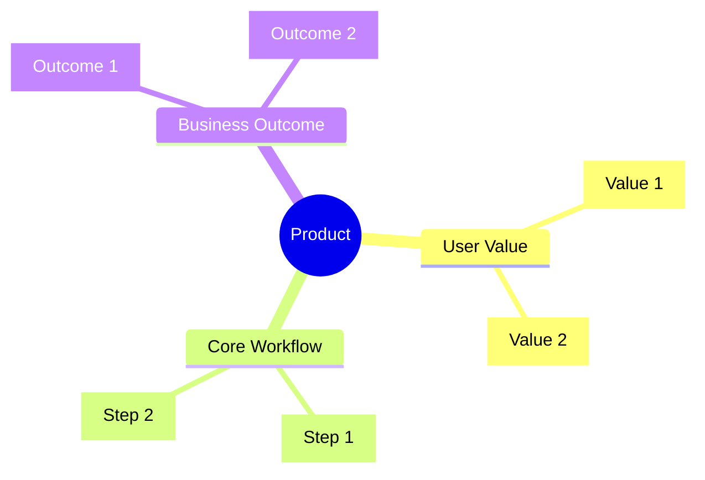
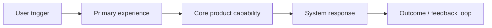
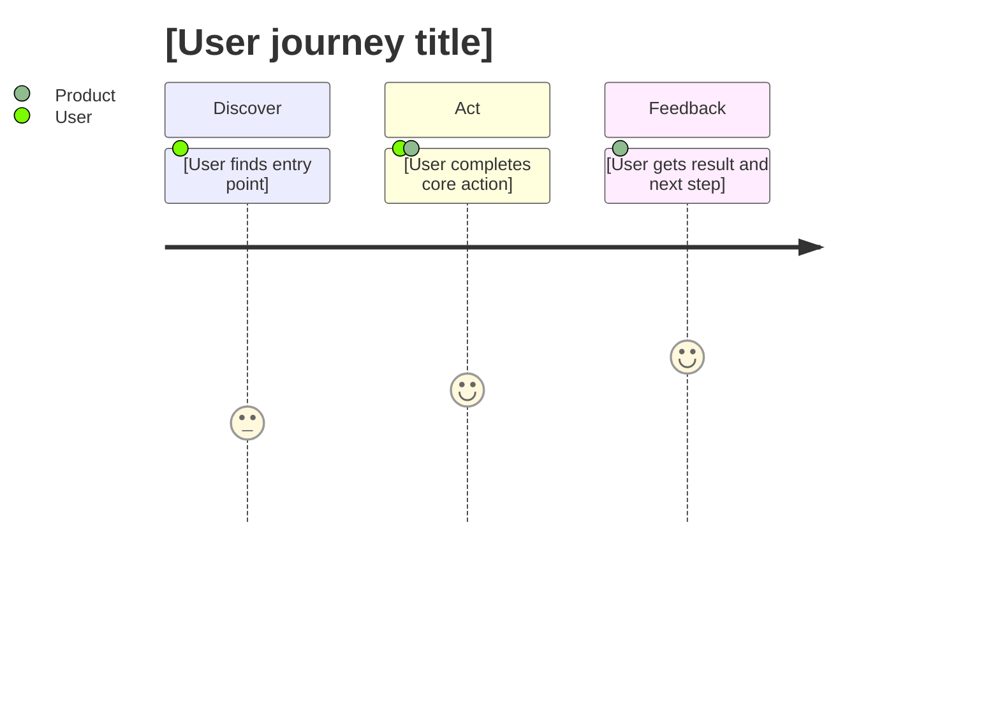
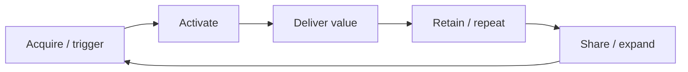
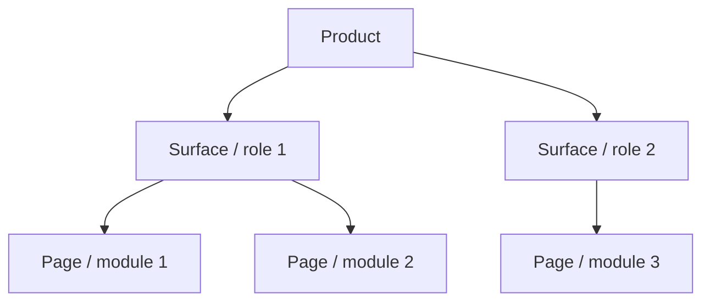
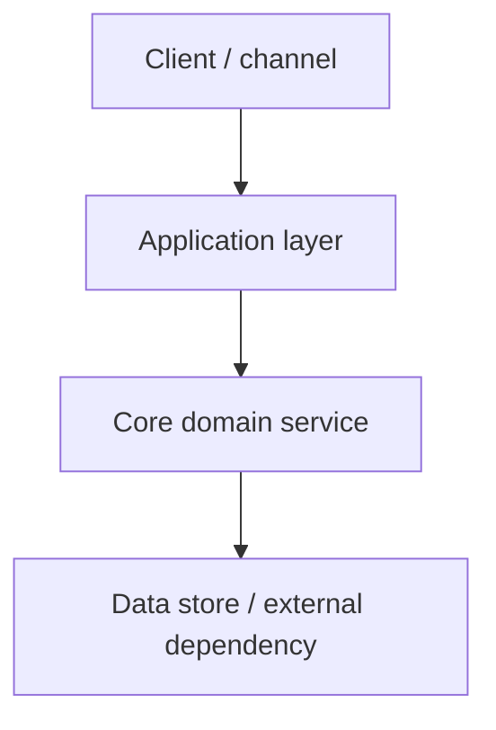

# PRD: [Feature/Initiative Name]

> **One-line definition:** [Describe the product in one sharp sentence]
>
> **Why now:** [Why this matters now]
>
> **This release is not:** [The most important thing we are intentionally not building]

`Stage: Draft` `Priority: P0` `Release: MVP` `Status: Need Review`

> **This page decision:** [What the reader should conclude from this document]
>
> **Needs approval from:** [Role / team]
>
> **Upstream inputs:** [Which docs or sections this page depends on]
>
> **Downstream outputs:** [Which docs, meetings, or teams will use this page next]

## Overview

### Problem Statement
<!-- Brief recap of the problem. Link to full problem statement if available. -->

[Problem summary]

### Solution Summary
<!-- High-level description of what we're building -->

[Solution summary]

### Target Users
<!-- Who will use this feature? -->

[Target user description]

## Executive Snapshot

| Lens | Summary |
|------|---------|
| User value | [What changes for the user] |
| Business value | [What changes for the business] |
| Product bet | [What this initiative is fundamentally betting on] |
| Core tradeoff | [What we are optimizing for, and what we are giving up] |

## Review Board

| Block | Key message | Why it matters | Owner |
|-------|-------------|----------------|-------|
| Decision | [Key decision] | [Impact] | [Owner] |
| Risk | [Main risk] | [Impact] | [Owner] |
| Dependency | [Critical dependency] | [Impact] | [Owner] |

## Review Use

| Meeting / use case | What this page should unblock |
|--------------------|-------------------------------|
| Product review | [Decision to make] |
| Engineering breakdown | [What gets decomposed next] |
| Milestone review | [What gets scheduled or gated] |

## Product Principles

- [Principle 1]
- [Principle 2]
- [Principle 3]

## Visual Map

### Cover Overview

<!-- Prefer Mermaid or text-native blocks that remain editable after publishing to Feishu. Avoid SVG as the default artifact. -->

### Experience / System View

### Experience Journey

### Product Loop

### Capability Stack

| Layer | Included in this release | Notes |
|-------|---------------------------|-------|
| Experience layer | [Yes/No] | [Notes] |
| Workflow layer | [Yes/No] | [Notes] |
| Platform / service layer | [Yes/No] | [Notes] |
| Ops / admin layer | [Yes/No] | [Notes] |

### Image / Reference Slot

*Caption: [What this image shows, what decision it supports, and why it matters.]*

## Goals & Success Metrics

### Goals
<!-- What outcomes are we trying to achieve? -->

1. [Primary goal]
2. [Secondary goal]
3. [Secondary goal]

### Success Metrics

| Metric | Current Baseline | Target | Timeline |
|--------|-----------------|--------|----------|
| [Primary metric] | [Value] | [Value] | [Date] |
| [Secondary metric] | [Value] | [Value] | [Date] |

### Metrics Funnel

| Funnel Stage | Definition | Current | Target | Owner |
|--------------|------------|---------|--------|-------|
| [Stage 1] | [Definition] | [Value] | [Value] | [Owner] |
| [Stage 2] | [Definition] | [Value] | [Value] | [Owner] |
| [Stage 3] | [Definition] | [Value] | [Value] | [Owner] |

### Non-Goals
<!-- What are we explicitly NOT trying to achieve? -->

- [Non-goal 1]
- [Non-goal 2]

## User Stories

<!-- Summary of key user stories. Link to detailed stories if available. -->

| ID | User Story | Priority |
|----|-----------|----------|
| US-1 | As a [user], I want [action] so that [benefit] | P0 |
| US-2 | As a [user], I want [action] so that [benefit] | P0 |
| US-3 | As a [user], I want [action] so that [benefit] | P1 |

See [link to detailed user stories] for full acceptance criteria.

## Scope

### In Scope
<!-- What will be delivered in this iteration -->

- [Feature/capability 1]
- [Feature/capability 2]
- [Feature/capability 3]

### Out of Scope
<!-- What will NOT be delivered -->

- [Excluded item 1]
- [Excluded item 2]

### Future Considerations
<!-- Items deferred to future iterations -->

- [Future item 1] . [Rationale for deferral]
- [Future item 2] . [Rationale for deferral]

## Solution Design

### Solution Shape

| Module | Purpose | Primary user | Priority |
|--------|---------|--------------|----------|
| [Module 1] | [Purpose] | [User] | P0 |
| [Module 2] | [Purpose] | [User] | P1 |

### Tradeoff Matrix

| Option | Upside | Downside | Decision |
|--------|--------|----------|----------|
| [Option A] | [Upside] | [Downside] | [Keep / Reject] |
| [Option B] | [Upside] | [Downside] | [Keep / Reject] |

### Functional Requirements

#### [Requirement Area 1]
<!-- Group related requirements -->

- FR-1: [Requirement statement]
- FR-2: [Requirement statement]

#### [Requirement Area 2]

- FR-3: [Requirement statement]
- FR-4: [Requirement statement]

### Requirement Breakdown Matrix

| Requirement | User task | Trigger | System response | Acceptance signal | Downstream owner |
|-------------|-----------|---------|-----------------|-------------------|------------------|
| [FR-1] | [Task] | [Trigger] | [Response] | [Acceptance] | [Eng / QA / Ops] |

### User Experience

<!-- Key UX decisions, flows, or wireframe references -->

[UX notes or link to designs]

### Experience Highlights

- [Moment of delight or speed]
- [Critical simplification]
- [Important guardrail or trust signal]

### UI Notes / Visual References

| Screen / module | Visual direction | Key component | Reference image | Note |
|-----------------|------------------|---------------|-----------------|------|
| [Screen 1] | [Direction] | [Component] | [Link / local path] | [Note] |

### Information Architecture View

<!-- For Feishu publishing, keep this dual-track: one Mermaid structure plus one editable hierarchy table. -->

| Level 1 | Level 2 | Level 3 | Primary task | Notes |
|---------|---------|---------|--------------|-------|
| [Portal] | [Home] | [Section] | [Task] | [Notes] |
| [Workspace] | [List] | [Detail] | [Task] | [Notes] |

### Edge Cases
<!-- Important edge cases to handle -->

| Scenario | Expected Behavior |
|----------|------------------|
| [Edge case 1] | [Behavior] |
| [Edge case 2] | [Behavior] |

## Technical Considerations

<!-- Technical constraints, architectural notes, or integration requirements -->

### Constraints
- [Constraint 1]
- [Constraint 2]

### Integration Points
- [System/API 1]: [Integration notes]
- [System/API 2]: [Integration notes]

### Data Requirements
<!-- Any data migration, storage, or privacy considerations -->

[Data notes]

### Architecture View

### Interface / Service Table

| Service / module | Input | Output | Depends on | Failure mode |
|------------------|-------|--------|------------|--------------|
| [Service 1] | [Input] | [Output] | [Dependency] | [Fallback] |

### Release Gate Table

| Gate | What must be true | Owner | Evidence |
|------|-------------------|-------|----------|
| [Gate 1] | [Condition] | [Owner] | [Proof] |

## Dependencies & Risks

### Dependencies

| Dependency | Owner | Status | Impact if Delayed |
|------------|-------|--------|-------------------|
| [Dependency 1] | [Team/Person] | [Status] | [Impact] |
| [Dependency 2] | [Team/Person] | [Status] | [Impact] |

### Risks

| Risk | Likelihood | Impact | Mitigation |
|------|------------|--------|------------|
| [Risk 1] | [H/M/L] | [H/M/L] | [Mitigation strategy] |
| [Risk 2] | [H/M/L] | [H/M/L] | [Mitigation strategy] |

### Risk Heatmap

| Impact \ Likelihood | Low | Medium | High |
|---------------------|-----|--------|------|
| High | [ ] | [ ] | [Risk] |
| Medium | [ ] | [Risk] | [ ] |
| Low | [ ] | [ ] | [ ] |

## Timeline & Milestones

| Milestone | Description | Target Date |
|-----------|-------------|-------------|
| [Milestone 1] | [Description] | [Date] |
| [Milestone 2] | [Description] | [Date] |
| [Launch] | [Description] | [Date] |

## Open Questions

<!-- Unresolved questions that need answers before or during development -->

- [ ] [Question 1] . Owner: [Name]
- [ ] [Question 2] . Owner: [Name]

## Appendix

### Related Documents
- Problem Statement . add link or path
- User Research . add link or path
- Design Specs . add link or path
- Technical Design . add link or path

### Visual Assets Checklist

- [ ] Cover overview is text-native and editable in Feishu
- [ ] Experience journey is present in Mermaid or table form
- [ ] Product loop is present in Mermaid or table form
- [ ] Information architecture is represented as editable structure, not a static image
- [ ] Information architecture includes both a diagram and a hierarchy table when publishing to Feishu
- [ ] Metrics funnel is represented as editable structure, not a static image
- [ ] At least one label row / decision card / review board is present
- [ ] Any image has a caption that explains why it is included
- [ ] Executive summary block is complete
- [ ] At least one experience or workflow diagram is included
- [ ] At least one architecture or system diagram is included
- [ ] Key tradeoffs are captured in a table rather than prose only

### Revision History

| Version | Date | Author | Changes |
|---------|------|--------|---------|
| 1.0 | [Date] | [Author] | Initial draft |

## Cross-Document Handoff

- This page should explicitly point readers to the next document they need.
- Core multi-file PRDs should maintain traceability across problem -> solution -> requirements -> rules -> architecture -> release plan.
